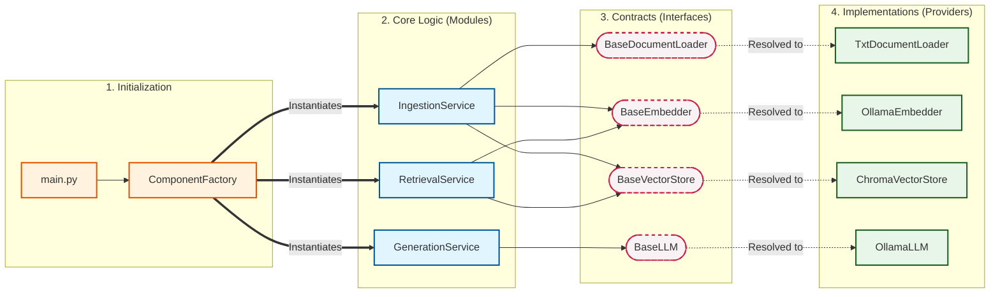

# 🚀 Modular RAG Architecture

[](https://www.python.org/)
[](https://opensource.org/licenses/MIT)
[](https://github.com/psf/black)

A production-grade, highly decoupled Retrieval-Augmented Generation (RAG) pipeline designed for extensibility, scalability, and local execution.

Unlike standard RAG tutorials that tightly couple business logic to specific frameworks (like LangChain) or proprietary APIs (like OpenAI), this project is built from the ground up using **SOLID principles**. Core logic depends entirely on abstract interfaces, allowing you to hot-swap LLMs, vector stores, and embedding models via a simple configuration file with **zero code changes**.

---

## 🏗️ Architecture

The system is strictly separated into Contracts (Interfaces), Workstations (Modules), and Concrete Tools (Providers). The `ComponentFactory` wires them together at runtime based on `config.yaml`.



## 📁 Directory Structure

```text
basic-rag-app/
├── main.py                     # Application entry point
├── config.yaml                 # System behavior and provider toggles
├── requirements.txt            # Python dependencies
├── core/
│   └── entities.py             # Shared data models (e.g., Document)
├── interfaces/                 # Abstract Base Classes (The Contracts)
│   ├── document_loader.py
│   ├── embedder.py
│   ├── llm.py
│   └── vector_store.py
├── modules/                    # Core business logic
│   ├── generation/             # Prompting and LLM orchestration
│   ├── ingestion/              # ETL pipeline (Load, Chunk, Embed, Store)
│   └── retrieval/              # Vector search and reranking logic
├── providers/                  # Concrete implementations
│   ├── chroma/                 # ChromaDB vector store
│   ├── local/                  # Local implementations (Ollama, Txt loader)
│   └── openai/                 # OpenAI API implementations (optional)
└── factories/
    └── component_factory.py    # Dependency injection logic
```

## ⚡ Getting Started

### 1. Prerequisites

By default, Version 1.0 runs entirely locally using Ollama. Ensure Ollama is installed and running, then pull the required models:

```bash
ollama pull qwen3:8b-q4_K_M
ollama pull qwen3-embedding:0.6b
```

### 2. Installation

Clone the repository and install dependencies:

```bash
git clone https://github.com/yagamiAbhi/basic-rag-app.git
cd basic-rag-app
pip install -r requirements.txt
```

### 3. Usage

Place the text data you want the assistant to learn in `Google.txt` at the project root (or update the `test_file` value in `main.py`).

Ensure your `config.yaml` is set properly (default uses Ollama + ChromaDB).

Start the app:

```bash
python main.py
```

The application ingests the document, stores embeddings in local ChromaDB, and opens a terminal chat loop for querying your data.

## 🧠 Extensibility (Developer Guide)

Because of the decoupled architecture, adding features is safe and straightforward. You should rarely need to modify `modules/`.

Example: adding PDF support
1. Create `providers/local/pdf_loader.py`.
2. Inherit from `BaseDocumentLoader` and implement `load()`.
3. Update `config.yaml` to include a PDF toggle/provider selection.
4. Update `ComponentFactory` to instantiate your loader when configured.

## 🗺️ Roadmap (V2 Preview)

- [ ] Advanced ingestion: support PDFs, CSVs, and web scraping.
- [ ] Semantic chunking: smarter text splitting inside the ingestion module.
- [ ] Advanced retrieval: integrate a cross-encoder reranker to improve search accuracy.
- [ ] Settings validation: implement `pydantic` in `config/settings.py` for strict config validation.
